# はじめに
このたびはmimi40をお買い上げいただきありがとうございます。
mimi40は以下のような特徴を持つキーボードです。
- 使用中に左右間のケーブルが抜けても故障しにくいType-C接続
- パームレストがずれることのない一体型
- マクロや左右のオーバーラップなど様々な用途に使用できる片側7uの配列
- シンプル・硬質なボトムマウト&FR4プレート

mimi40によってあなたのキーボードライフがより良いものとなれば幸いです。

# 1. 準備
## 1.1. パーツ・工具の確認
### 1.1.1 キットに含まれるパーツ・工具
キットには以下のパーツ・工具が含まれています。
不足がある場合は[6. 連絡先](#6-連絡先)までご連絡ください。

| 名称                    | 数量        | 画像                                            | 説明                                                              |
|-------------------------|-------------|-------------------------------------------------|-------------------------------------------------------------------|
| 右ボディ                | 1           | 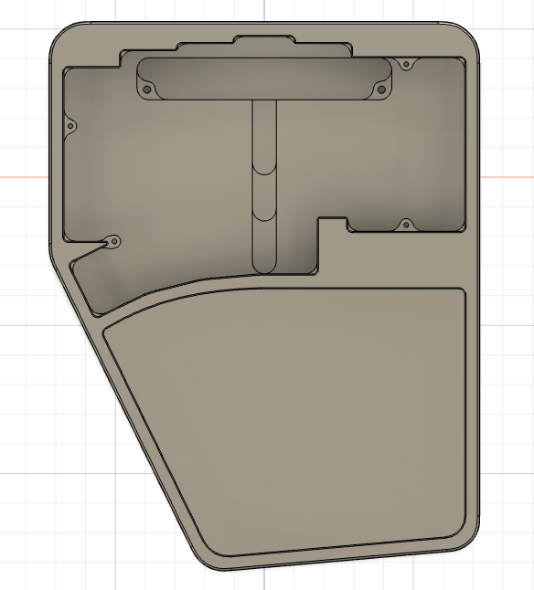            | アルミ製の右手用ボディ。                                          |
| 左ボディ                | 1           | 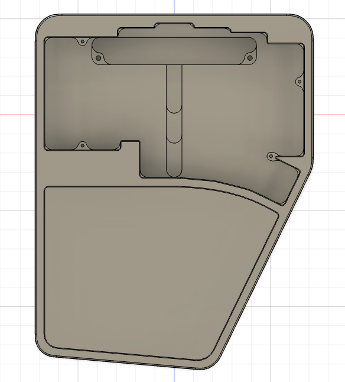             | アルミ製の左手用ボディ。                                          |
| 右パームレスト          | 1           |  | 右手用ウォルナット製パームレスト。                                |
| 左パームレスト          | 1           |  | 左手用ウォルナット製パームレスト。                                |
| 右PCB                   | 1           | 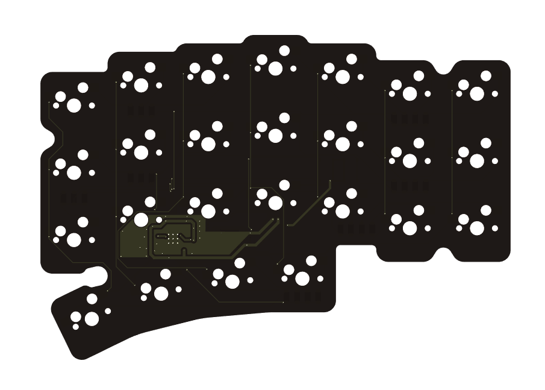                  | 右手用メイン基板。パーツはすべて実装済みです。厚みは1.6mm。       |
| 左PCB                   | 1           | 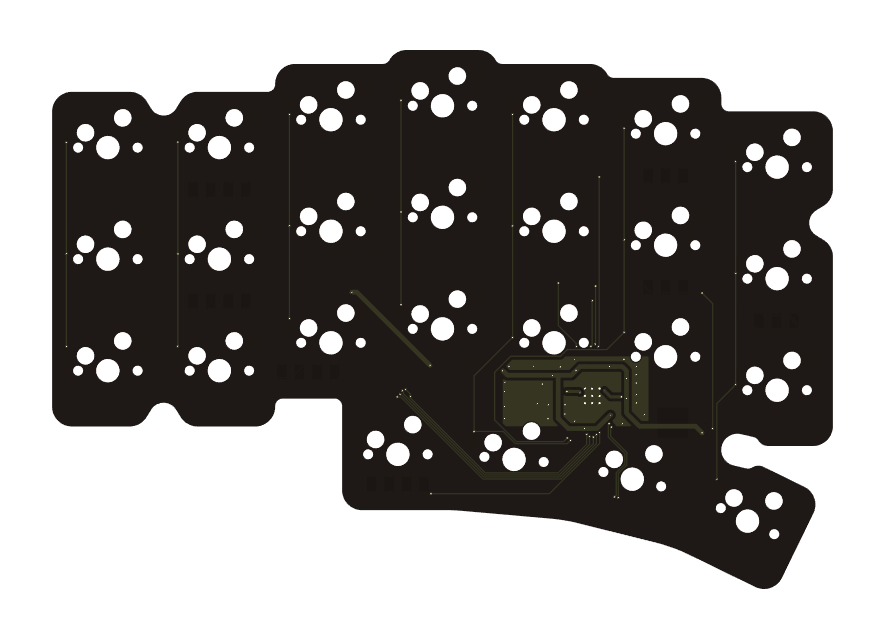                   | 左手用メイン基板。パーツはすべて実装済みです。厚みは1.6mm。       |
| 右ドーターボード        | 1           | 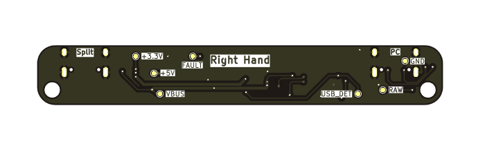      | USBコネクターが二つ付いた右手用基板。                             |
| 左ドーターボード        | 1           | 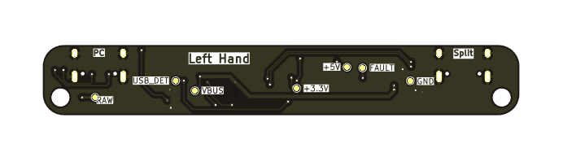         | USBコネクターが二つ付いた左手用基板。                             |
| フラットケーブル        | 4(内予備2)  | 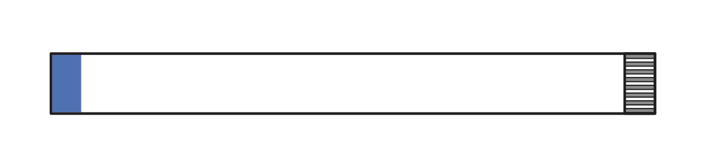     | ドータボードとPCBを接続するためのケーブル。80mm 8P 0.5mmピッチ。  |
| 左右間接続用USBケーブル | 1           |                                                 | 左右間のキーボードを接続するためのUSB Type-Cケーブル。            |
| スイッチプレート        | 2           | 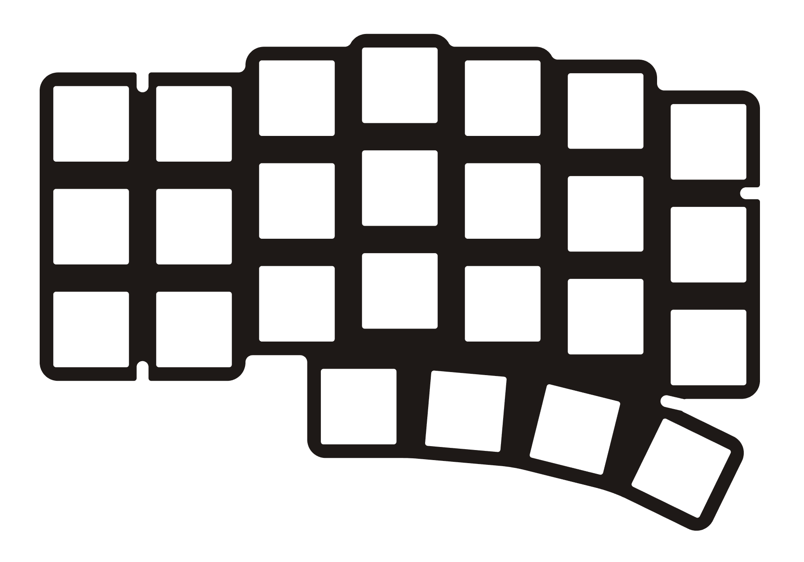          | キースイッチを固定するためのプレート。FR4製1.6mm。                |
| ミドルフォーム          | 2           | 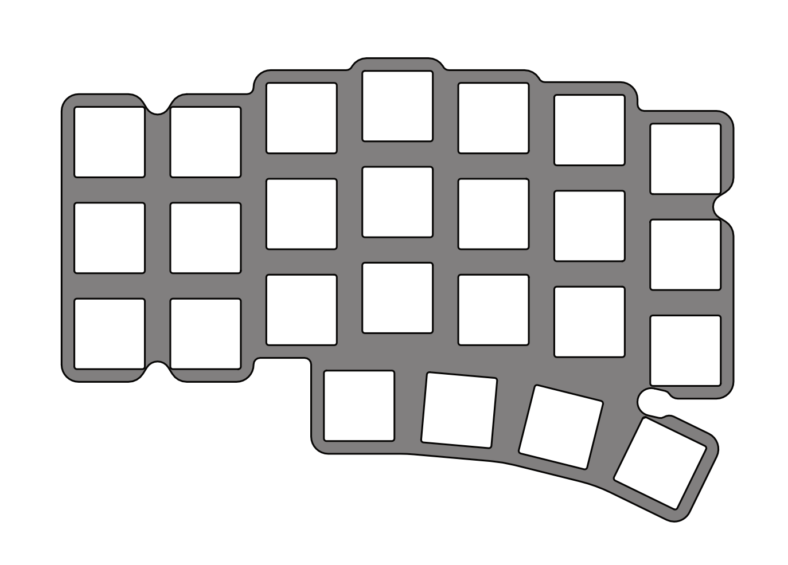        | スイッチプレートとPCBの間に挟む4mm厚のSlimFlex(旧PORON)フォーム。 |
| M2x5 精密ねじ           | 8(内予備2)  |                                                 | スイッチプレートをボディに取り付けるためのねじ。                  |
| M3x5 なべねじ           | 8(内予備2)  |                                                 | ドーターボードをボディに取り付けるためのねじ。                    |
| パームレスト滑り止め    | 10          |                                                 | パームレストのかたつきを防ぐための滑り止め。                      |
| ゴム足                  | 12(内予備4) |                                                 | メインケースに貼り付ける滑り止め。                                |
| +ドライバー             | 1           |                                                 | ねじを締め付けるために使用します。                                |

### 1.1.2. ご自身でご用意いただくパーツ・工具
キット以外に以下のパーツが必要になります。
ご自身でお気に入りのものをご用意ください。

| 名称                 | 数量    | 説明                                                                                                     |
|----------------------|---------|----------------------------------------------------------------------------------------------------------|
| MX(互換)キースイッチ | 50      | お好みのスイッチをご用意ください。                                                                       |
| MX(互換)キーキャップ | 1セット | お好きなものをご用意ください。                                                                           |
| USB Type-Cケーブル   | 1       | お好みのものをご用意ください。ただし、コネクター部分の形状によっては奥まで挿し込めない可能性があります。 |

## 1.2. PCBの動作確認
### 1.2.1. Vial環境の準備
キーマップの変更にはVial( https://get.vial.today )を使用します。
以下のいずれかの環境をご用意ください。
- Web版（最新のChrome、Chromium、Edge推奨）
- デスクトップアプリ版

### 1.2.2. 接続確認
以下手順を左右分行い、問題ないことを確認してください。
1. PCBとドーターボードをフラットケーブルで接続する
2. USB Type-CケーブルでPCとドーターボードを接続する
3. Web版、またはデスクトップアプリ版Vialを起動し、キーボードが認識されていることを確認する
   - 認識しない場合は[5. トラブルシューティング](#5-トラブルシューティング)をご確認ください。
4. 確認できたらPCから取り外し、PCB、ドーターボード、フラットケーブルに分解する

# 2. 組み立て
## 2.1. PCB組み立て
以下手順を左右分行ってください。
1. スイッチプレートの四隅にスイッチを取り付ける  
   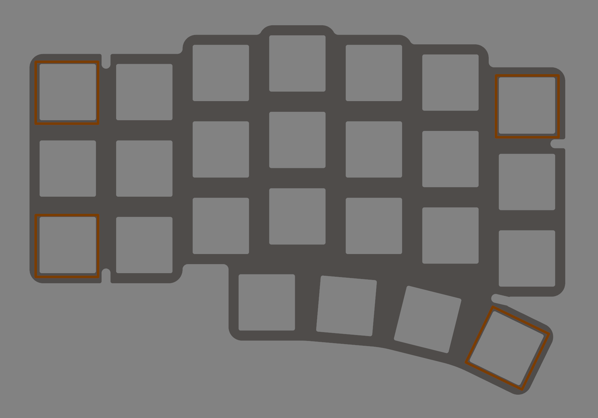
2. スイッチと穴の位置を合わせて、スイッチプレートにフォームを重ねる
   - お好みでこの手順はスキップしてください。フォームを入れないことでより打鍵音が響くようになります。
3. スイッチの足がソケットに挿さるようにPCBを乗せ、しっかりと押し込む
4. スイッチプレートの空いている箇所にスイッチを取り付ける
   - スイッチの足がソケットの奥まで挿さるようにソケットを指で抑えながらしっかりと押し込んでください。

## 2.2. ドーターボード取り付け
1. ドーターボードにフラットケーブルを取り付ける
   - フラットケーブルの端子が基板側を向くように取り付けます。  
     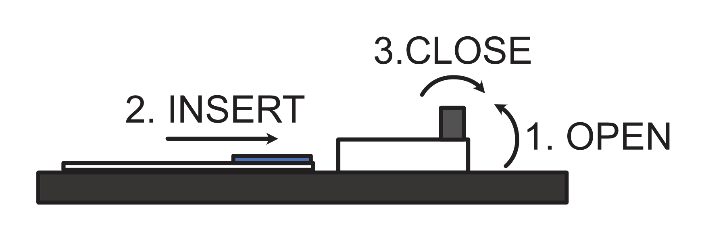
2. ケースに`M3x5 なべねじ`でドーターボードを取り付ける  
   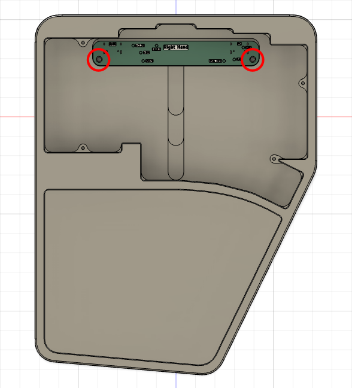

## 2.3. 組み立て
1. PCBとドーターボードをフラットケーブルで接続する
   - フラットケーブルの端子が基板側を向くように取り付けます。  
     
2. PCBをボディに入れ、スイッチプレートを`M2x5 精密ねじ`で固定する  
   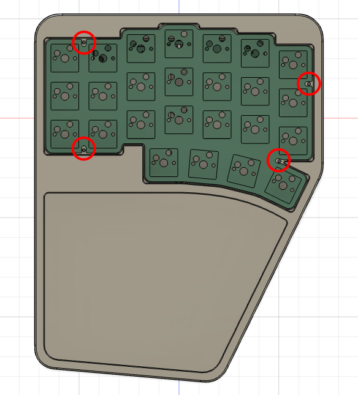
3. ケース底面にゴム足を貼り付ける

## 2.4. 動作確認
1. USB Type-Cケーブルで左右を接続する
   - 左右それぞれの内側のポート同士をケーブルで接続してください。
2. USB Type-CケーブルでPCとmimi40キーボードを接続する
   - 左右どちらかの外側のポートにケーブルを接続してください。  
     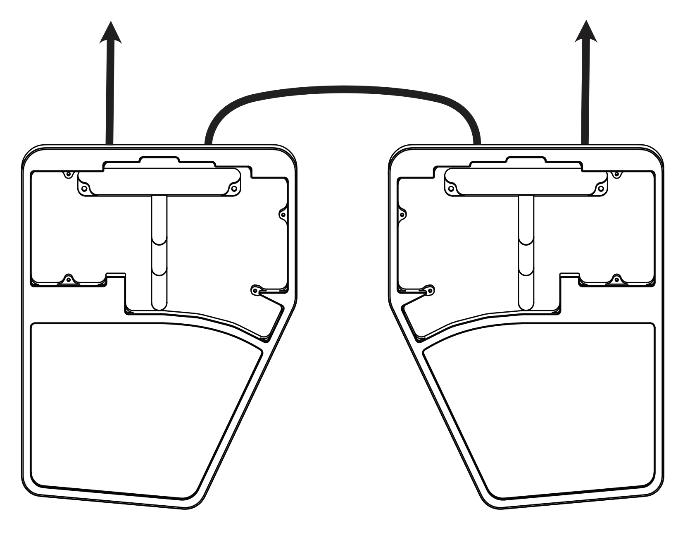
3. Web版、またはデスクトップアプリ版Vialを起動する  
   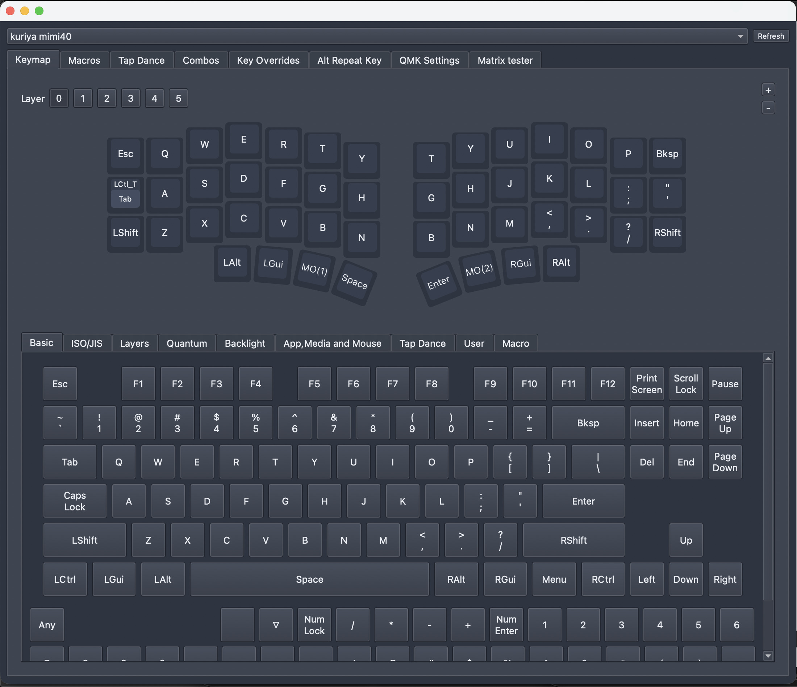
5. `Matrix tester`タブを表示し、 `Unlock`ボタンをクリックする  
   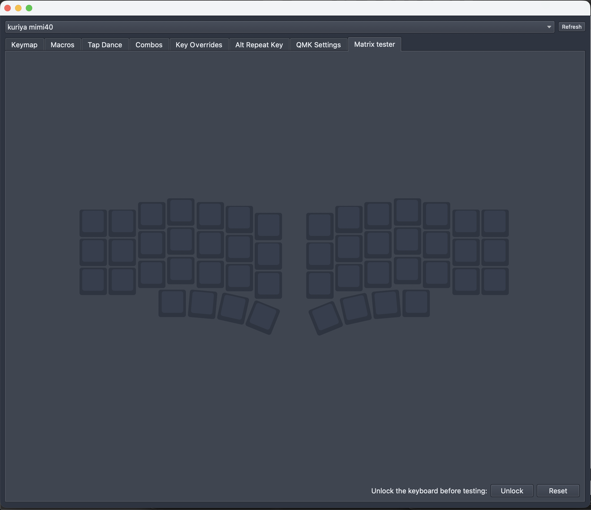
6. 表示された二箇所のキーを長押しするk`x
   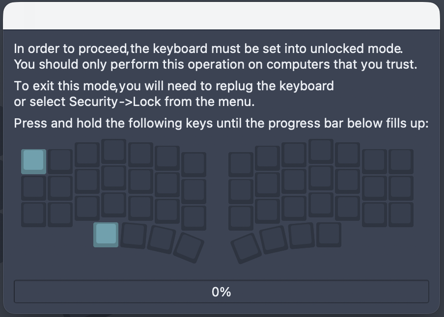
   - キーを押しているのに進捗バーが進まない場合、キーが反応していない可能性があります。
     [5. トラブルシューティング](#5-トラブルシューティング)をご確認ください。
7. 全キーが反応することを確認する
   - 反応しないキーがある場合は[5. トラブルシューティング](#5-トラブルシューティング)をご確認ください。

## 2.5. キーキャップ取り付け
用意したお気に入りのキーキャップを取り付けてください。
もう少しで完成です。

# 3. キーマップの設定
`Keymap`タブを表示し、お好みのキーマップを設定してください。  
画面上部から変更したいキーをクリックし、その後、設定したいキーを画面下部から選択します。  

# 4. メンテナンス
## 4.1. ファームウェア更新
1. キーキャップを外す
2. スイッチプレートを固定している`M2x5 精密ねじ`を外す
3. PCBを取り出す
   - フラットケーブルを引っ張らないようにゆっくり取り出してください。
3. USB Type-CケーブルでPCとDeco40キーボードを接続する
4. PCBの`BOOT`スイッチを押しながら`RESET`スイッチを押す
   - PCにUSBストレージとして認識されます。
5. 認識したUSBストレージに新しいファームウェアをコピーする
   - コピーが完了すると自動でUSBストレージが取り出され、キーボードとして認識されます。
6. 組み立てる

# 5. トラブルシューティング
## 5.1. キーボードがPCに認識されない
以下手順を順番に試してください。
1. ドーターボードとPCBの接続を確認する
   - ドーターボード・PCB両方のソケットの奥までフラットケーブルが挿さっていることを確認してください。
2. USB Type-Cケーブルが奥まで挿さっているか確認する
   - コネクター部分の形状によってはケースと干渉する可能性があります。  
     別のUSB Type-Cケーブルでの接続もお試しください。
3. [6. 連絡先](#6-連絡先)に連絡する
   - お手数をおかけしますが、連絡先のいずれかから私に連絡をしてください。  
     その際詳しい症状・写真も添付していただけますとありがたいです。

## 5.2. 反応しないキーがある
以下手順を順番に試してください。
1. 反応しないキーのスイッチを外す
2. キースイッチの足が曲がっていないことを確認する
   - 足が曲がっていた場合は新しいキースイッチに交換するか、足を真っ直ぐに修正してから再度取り付けてください。
3. キースイッチが正しく挿さっていることを確認する
   - キースイッチがスイッチプレートから浮いている場合は、浮かないように奥まで挿してください。
4. [6. 連絡先](#6-連絡先)に連絡する
   - お手数をおかけしますが、連絡先のいずれかから私に連絡をしてください。  
     その際詳しい症状・写真も添付していただけますとありがたいです。

# 6. 連絡先
- X(Twitter): https://x.com/kuriki_sasa
- Discord: kurikisasa
- Discord server: https://discord.gg/pC4t9NJStE

# さいごに
無事、完成できましたでしょうか？
感想・写真などありましたらお気軽に教えていただけると喜びます！
良きキーボードライフを！
